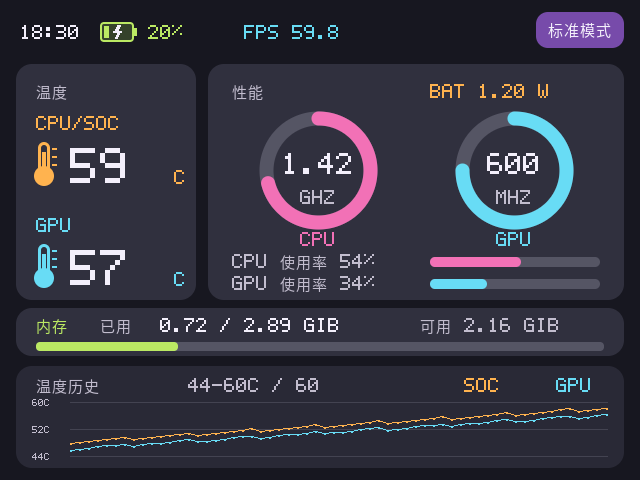
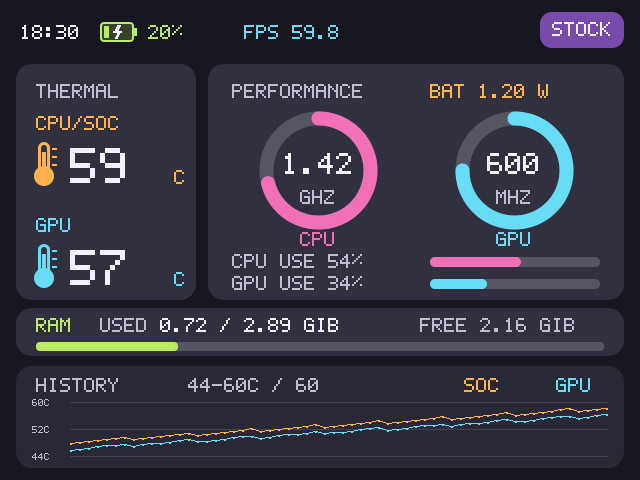

> **免责声明（使用前必读）**
> 本项目是非官方、免费、个人维护的开源工具，按现状提供，不保证兼容性、稳定性或持续维护。在适用法律允许的范围内，作者及贡献者不对使用造成的设备异常、数据/存档丢失等损失承担责任。使用前请核对机型与版本、备份数据并阅读[完整免责声明](DISCLAIMER.md)。目前仅在一台 M1 Mac mini 和一台 Windows 10 电脑测试，其他环境未全面验证。

# GammaOSTool

为 RG DS / GammaOS 提供性能面板与主菜单时钟修复的非官方桌面工具。免费使用，业余维护，用爱发电。

[下载发布版本](https://github.com/llMrRongll/GammaOSTool/releases) · [安装与卸载](docs/INSTALL.md) · [反馈问题](https://github.com/llMrRongll/GammaOSTool/issues)

## 当前功能

- 内置 Nano NDS 游戏的下屏性能面板，BTN_MODE 显示/隐藏，每次进游戏默认隐藏。
- CPU/SoC 与 GPU 温度、频率、使用率、内存、温度历史和电池端功率。
- 左上角时间及电量，绿色电池与内部闪电表示充电。
- 下屏实际呈现 FPS：统计 DRM 翻帧完成次数；隐藏时停止采样。重复呈现同一画面也计数，不等于游戏内部不同画面的数量。
- Windows/macOS 图形安装器，提供检测、安装、验证、移除与日志导出。
- 独立 XMB 下屏时钟补丁，修复表盘上下边缘裁剪；只支持校验通过的主菜单程序。

当前公开版不包含触摸区域转发或加速按钮；这两项仍是开发实验。

## 界面预览

以下是共用渲染器生成的 **示例数据预览**，不是当前设备实测截图，也不是性能承诺。

英文界面预览

## 适用范围与测试情况

掌机适配范围：RG DS、GammaOS Core 1.4.1 / 1.4.4、已具备 Root 和 Magisk、内置 Nano NDS。不会替用户解锁、获取 Root 或刷系统，不支持通用模拟器或其他机型。

| 电脑环境 | 验证范围 |
|---|---|
| M1 Mac mini | 作者当前使用的设备上进行开发与测试；macOS 安装器为本地 ad-hoc 签名 |
| 一台 Windows 10 电脑 | 用户反馈已测试；不代表所有 Windows 10 电脑均兼容 |
| Intel Mac、Windows 11、其他电脑/系统版本 | 未实机验证；Intel Mac 仅编译通过 |

安装器当前版本 **1.0.21**，内置性能面板 **1.0.12**、时钟补丁 **1.0.2**。本次 1.4.4 兼容更新重新编译了 Mac 两种架构，并通过安装操作模拟测试；Windows 包已更新，未再次实机复测。

## 下载与使用

1. 从 Releases 下载对应电脑的 ZIP，并完整解压。
2. 阅读压缩包内的使用说明和免责声明，先备份数据、保存游戏进度。
3. 用 USB 数据线连接掌机，开启 USB 调试，允许电脑调试和 Shell 的 Root 授权。
4. 先“检测设备”，再“安装面板”。进入 Nano NDS 游戏后按 BTN_MODE 查看。
5. 时钟补丁独立安装/移除，系统更新前先移除时钟补丁。

Windows 使用内置 PowerShell/WinForms；Mac 使用 AppKit。Mac 安装器没有 Developer ID 公证，Windows 安装器没有商业代码签名，系统可能显示来源提示。仅运行你信任且校验通过的文件。更多细节见[安装说明](docs/INSTALL.md)。

## 反馈与维护

反馈请提供机型、系统版本、电脑系统、工具版本、操作步骤与现象。导出日志可能包含设备标识和本地路径，分享前请自行检查并删除私人信息。

本项目没有商业售后、响应时限或固定更新计划。赞助入口暂未设置；如后续开放，支持始终自愿，不影响免费下载和问题反馈，也不承诺功能交付。

## 源码与许可

原创源码采用 [Apache License 2.0](LICENSE)，按现状提供。第三方组件保留原许可，见 [第三方说明](THIRD_PARTY_NOTICES.md)。源码不包含 ROM、BIOS、游戏存档或 DraStic 模拟器。

构建与目录说明见 [BUILD.md](docs/BUILD.md)。

面板 1.0.12 按驱动名称识别下屏图层，同时支持 1.4.1 的 Smart 和 1.4.4 的 Cluster 游戏显示。1.4.4 已实机验证启动、显示与 FPS；用户已在 1.4.1 实机使用新版安装工具测试，确认面板可正常打开。电脑端本次重新编译 Mac，Windows 包已更新但未再次实机验证。
